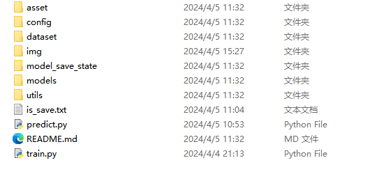

## 1、项目介绍
这是一个深度学习技术的二手汽车价格预测，使用的数据集是阿里云的二手汽车数据集。
This is a used car price prediction by deep learning technology, using Alibaba Cloud's used car data set.

## 2、具体流程

* 导入库
    *  pytorch
* 1、定义数据集 SaleDataSet
* 2、定义数据加载器
* 3、实例化模型，加载模型，设置损失函数，优化器
* 4、训练模型
* 5、保存模型

## 3、问题反馈
在使用中遇到问题，欢迎反馈给我，可以用以下联系方式跟我交流

* 邮件: 2826389624@qq.com
## 4、结果展示

